1. Average and Total Salary

SELECT AVG(Salary) AS Average_Salary, SUM(Salary) AS Total_Salary FROM Employee;

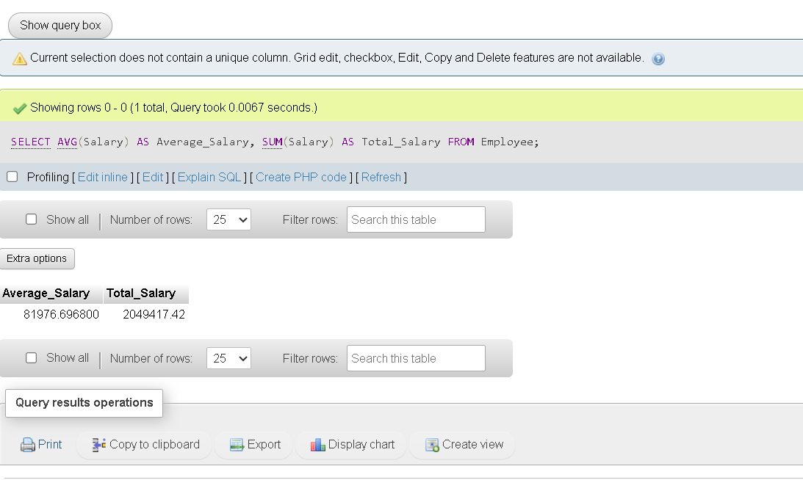

2. Count Employees in a Department

SELECT COUNT(*) AS Employee_Count FROM Employee WHERE Deptcode = '3A';

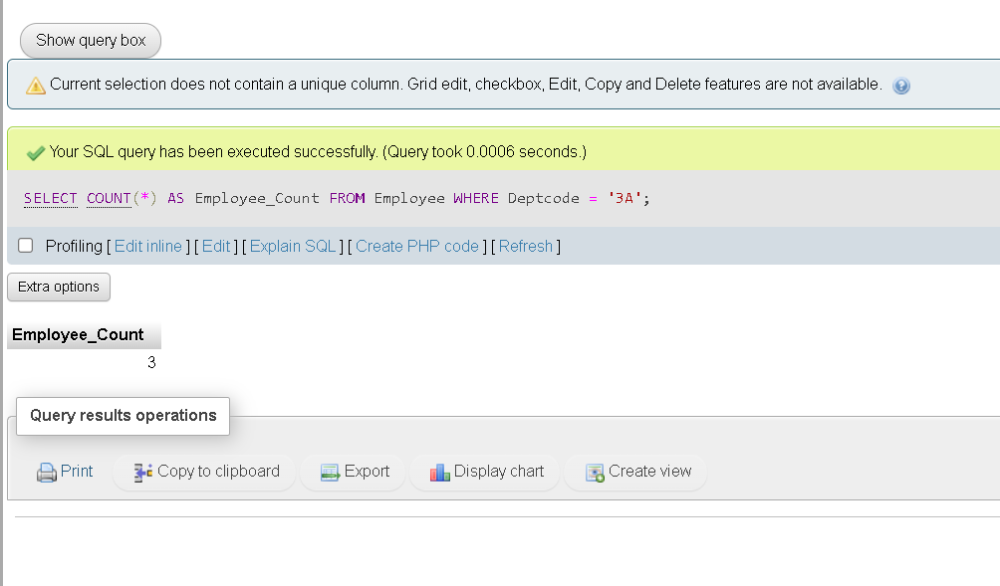

3. Name Pattern Search

SELECT Name FROM Employee WHERE Name LIKE 'M%' AND LENGTH(Name) >= 4;

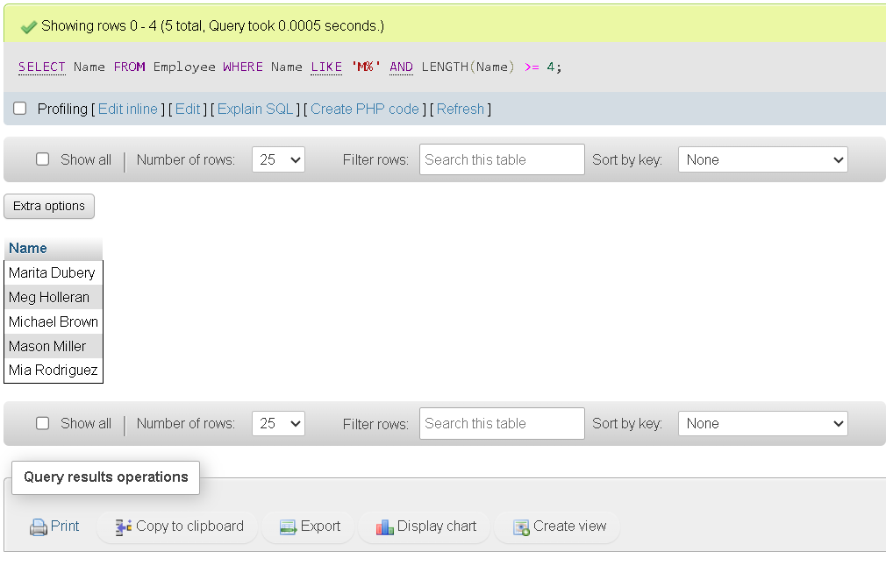

4. Employees by Job Title

SELECT * FROM Employee WHERE Job = 'Software Engineer';

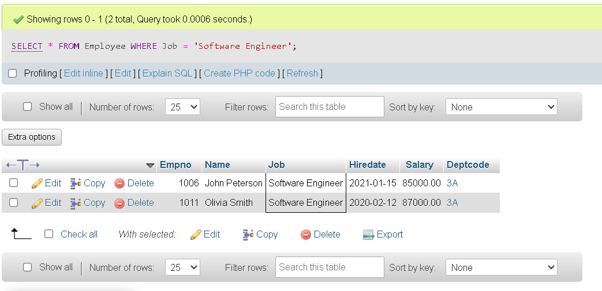

5. Employees Hired Between Two Dates

SELECT * FROM Employee WHERE Hiredate BETWEEN '2018-01-01' AND '2021-12-31' ORDER BY Name;

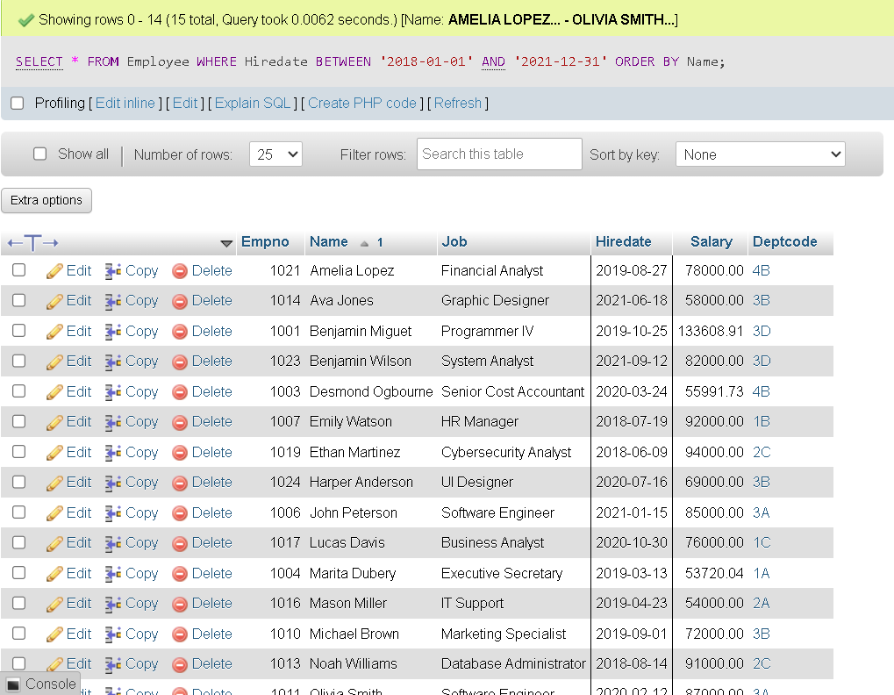

6. Min & Max Salary

SELECT 
    MIN(Salary) AS Minimum_Salary,
    MAX(Salary) AS Maximum_Salary
FROM Employee;

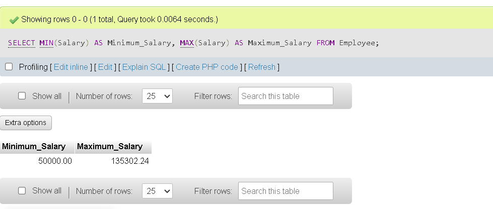

7. Earliest & Latest Hire Date

SELECT 
    MIN(Hiredate) AS Earliest_Hire_Date,
    MAX(Hiredate) AS Latest_Hire_Date
FROM Employee;

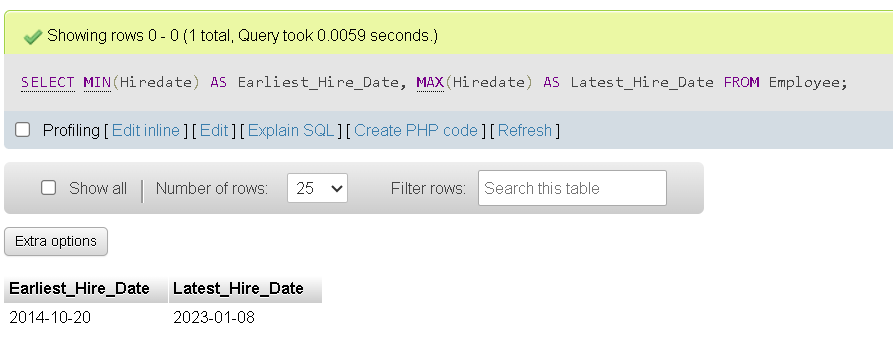

8. Employee Count per Department

SELECT 
    d.Deptlocation,
    COUNT(e.Empno) AS Employee_Count
FROM Department d JOIN Employee e ON d.Deptcode = e.Deptcode GROUP BY d.Deptlocation;

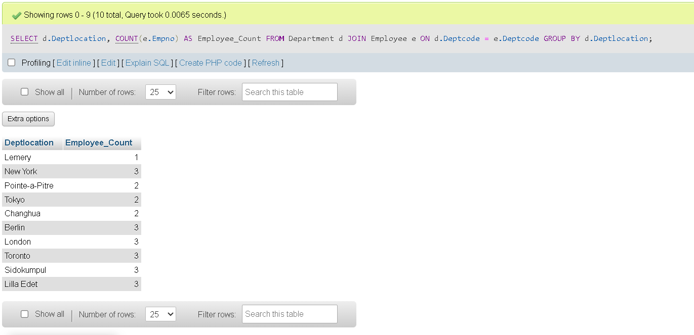

9. Average Salary per Department

SELECT 
    d.Deptlocation,
    AVG(e.Salary) AS "Average Salary"
FROM Department d JOIN Employee e ON d.Deptcode = e.Deptcode GROUP BY d.Deptlocation;

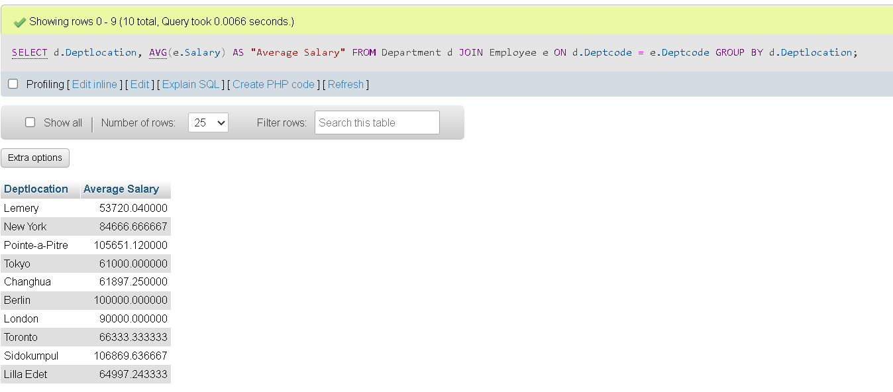

10. High-Salary Departments

SELECT 
    d.Deptlocation,
    SUM(e.Salary) AS Total_Salary
FROM Department d JOIN Employee e ON d.Deptcode = e.Deptcode GROUP BY d.Deptlocation HAVING SUM(e.Salary) > 100000;

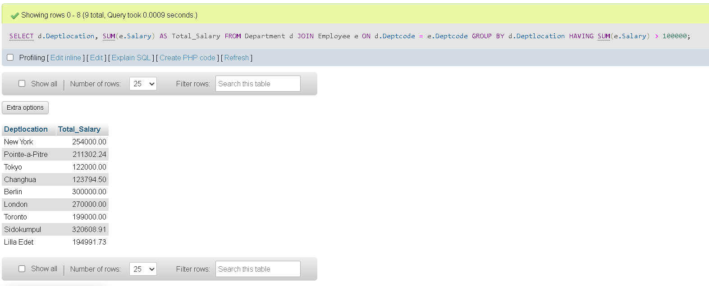

11. Employees in a Location

SELECT 
    e.Name,
    e.Job,
    d.Deptlocation
FROM Employee e JOIN Department d ON e.Deptcode = d.Deptcode WHERE d.Deptlocation = 'London';

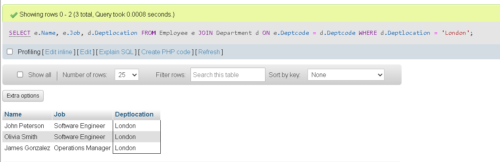

12. Total Salary by Department & Job Title

SELECT 
    d.Deptlocation,
    e.Job,
    SUM(e.Salary) AS Total_Salary
FROM Employee e JOIN Department d ON e.Deptcode = d.Deptcode GROUP BY d.Deptlocation, e.Job;

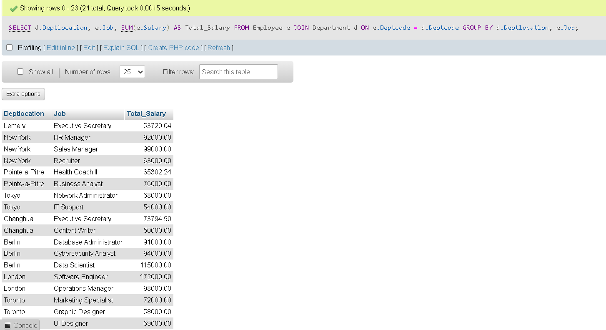